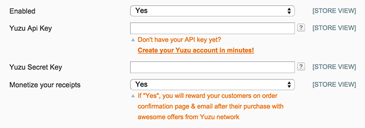

## Overview

Yuzu provides to e-merchants solutions to improve their profitability. With this extension, YUZU will be able to collect data and showcase your promotional offers.

This extension allows you to fully use the Yuzu Platform.

## Prerequisite

Magento CE compatible 1.5.x to 1.9.x

## Download extension

[Click here to download the latest version of Yuzu Plugin for Magento](http://www.magentocommerce.com/magento-connect/yuzu.html)

## Installation

#### Magento Connect Install

* Go on [Magento Connect](http://www.magentocommerce.com/magento-connect/yuzu.html) and get Extension Key.
* Navigate to your Magento Admin Panel and select Manage Extension under the System Menu
* After logging in with your Admin login, paste in the extension key you copied and click the “Install” button.

## Configuration

Login into your Magento Admin Panel, go to System > Configuration. 

A new entry is available on the left: YUZU > Yuzu API

* **Enable**: Enable or disable this Magento Extension
* **Yuzu API Key**: If you have an existing Yuzu account, retrieve your API Key from [my.yuzu.co](https://my.yuzu.co). If you have no Yuzu account, [create your account now](https://my.yuzu.co/register?from=magento) and fill the Yuzu Api Key 
* **Yuzu Secret Key**: If you have an existing Yuzu account, retrieve your API Secret Key from [my.yuzu.co](https://my.yuzu.co). If you have no Yuzu account, [create your account now](https://my.yuzu.co/register?from=magento) and fill the Yuzu Secret Key

---
    