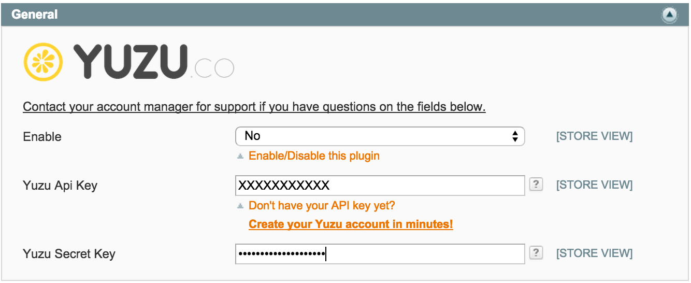

## Overview

Yuzu provides to e-merchants a solution to reach real & active shoppers for less. With this extension, YUZU will be able to collect data and showcase your promotional offers.

This extension allows you to fully use the Yuzu Platform.

## Prerequisite

Magento CE compatible 1.5.x to 1.9.x

## Download extension

[Click here to download the latest version of Yuzu Plugin for Magento](plugins/magento/yuzu-1.0.1.tgz)

## Installation

There are two ways to install this Magento Extension: **Magento Connect** or **Manual Install**.

#### Magento Connect Install

* In your Magento Admin Panel go to System > Magento Connect > Magento Connect Manager.
* Use your admin account to login again.
* In “Direct package file upload” section, upload your yuzu-x.x.x.tgz file and click to
Upload.

* The extension will be installed automatically.
* Clear the cache: go to System > Cache Management. Clear the store cache.
* Re-login: Log out and log back into Magento Admin Panel.

#### Manuel Install

* Extract the extension’s content on your computer and navigaate inside the extracted folder.
* Use your FTP client to upload the contents of the extension on your remote store (with the same folder tree).
* Connect to Magento Admin Panel.
* Clear the cache: go to System > Cache Management. Clear the store cache.
* Re-login: Log out and log back into Magento Admin Panel.

## Configuration

Login into your Magento Admin Panel, go to System > Configuration. 

A new entry is available on the left: YUZU > Yuzu API

* **Enable**: Enable or disable this Magento Extension
* **Yuzu API Key**: If you have an existing Yuzu account, retrieve your API Key from [my.yuzu.co](https://my.yuzu.co). If you have no Yuzu account, [create your account now](https://my.yuzu.co/register?from=magento) and fill the Yuzu Api Key 
* **Yuzu Secret Key**: If you have an existing Yuzu account, retrieve your API Secret Key from [my.yuzu.co](https://my.yuzu.co). If you have no Yuzu account, [create your account now](https://my.yuzu.co/register?from=magento) and fill the Yuzu Secret Key

---

* **Display in checkout success**: If “Yes”, Yuzu Offers will be displayed in checkout success page.
* **Display in order show**: If “Yes”, Yuzu Offers will be displayed in order detail page.
* **Display in order confirmation email**: If “Yes”, Yuzu Offers will be sent in email order confirmation.
* **Display in invoice email**: If “Yes”, Yuzu Offers will be sent in invoice email.
* **Display in shipment email**: If “Yes”, Yuzu Offers will be sent in shipment email.
* **Nb offers to display in emails**: Select the number of offers you want to display in emails.

--- 

* **Display in checkout success**: If “Yes”, Yuzu Offers will be displayed in checkout success page.
* **Display in order show**: If “Yes”, Yuzu Offers will be displayed in order detail page.
* **Display in order confirmation email**: If “Yes”, Yuzu Offers will be sent in email order confirmation.
* **Display in invoice email**: If “Yes”, Yuzu Offers will be sent in invoice email.
* **Display in shipment email**: If “Yes”, Yuzu Offers will be sent in shipment email.
* **Nb offers to display in emails**: Select the number of offers you want to display in emails.

    