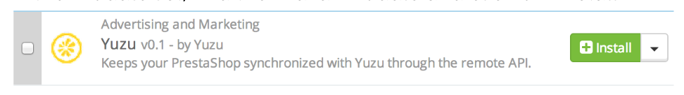

## Overview

Yuzu provides to e-merchants a solution to reach real & active shoppers for less. With this extension, YUZU will be able to collect data and showcase your promotional offers.

This extension allows you to fully use the Yuzu Platform.

## Prerequisite

Compatible Prestashop 1.4.x to 1.6.x

## Download extension

[Click here to download the latest version of Yuzu Plugin for Prestashop](plugins/prestashop/yuzu-latest.zip)

## Update your module

If you have an older version of yuzu module, you have to uninstall the module first. After that you have to delete the module. And finally, you can install the new version of the module.

## Installation

Log in to your PrestaShop Admin Panel and install the module:

* Go to Modules

* Click on “Add a new module”

* Select the yuzu-xxx.zip file and upload it.

* In the module list, find the “Yuzu” module and click on “Install”

## Configuration

* **Yuzu API Key**: If you have an existing Yuzu account, retrieve your API Key from [my.yuzu.co](https://my.yuzu.co). If you have no Yuzu account, [create your account now](https://my.yuzu.co/register?from=prestashop) and fill the Yuzu Api Key 
* **Yuzu Secret Key**: If you have an existing Yuzu account, retrieve your API Secret Key from [my.yuzu.co](https://my.yuzu.co). If you have no Yuzu account, [create your account now](https://my.yuzu.co/register?from=prestashop) and fill the Yuzu Secret Key
* **Display offers in order detail**: If “Yes”, Yuzu Offers will be displayed in order detail page. 
* **Display offers in checkout success**: If “Yes”, Yuzu Offers will be displayed in checkout success page.
* **CSS selector: add to cart**: ONLY FOR DEVELOPER — Css selector for the Add to cart event on product pages.