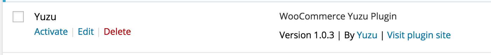
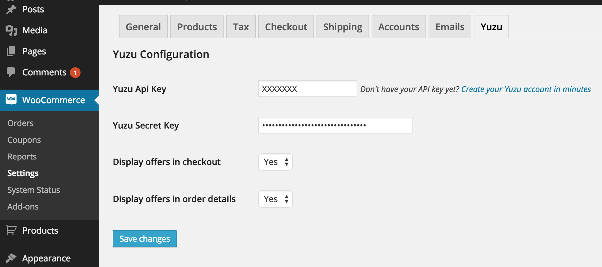

## Overview

Yuzu provides to e-merchants a solution to reach real & active shoppers for less. With this extension, YUZU will be able to collect data and showcase your promotional offers.

This extension allows you to fully use the Yuzu Platform.

## Prerequisite

Woocommerce > v2.1

## Download plugin

[Request Woocommerce plugin](http://www.yuzu.co)

## Installation

#### Install

* Go on your Woocommerce Admin Panel > Plugins > Add new > Upload Plugin
* Upload  woocommerce-yuzu-latest.zip > Install now

* Clic on "Activate" on Yuzu Plugin

## Configuration

Login into your Wordpress Admin Panel, go to Woocommerce > Settings > Yuzu. 

* **Yuzu API Key**: If you have an existing Yuzu account, retrieve your API Key from [my.yuzu.co](https://my.yuzu.co). If you have no Yuzu account, [create your account now](https://my.yuzu.co/register?from=woocommerce) and fill the Yuzu Api Key 
* **Yuzu Secret Key**: If you have an existing Yuzu account, retrieve your API Secret Key from [my.yuzu.co](https://my.yuzu.co). If you have no Yuzu account, [create your account now](https://my.yuzu.co/register?from=woocommerce) and fill the Yuzu Secret Key
* Display offers in checkout : Set to "Yes" to display Yuzu offers in checkout success page
* Display offers in order details : Set to "Yes" to display Yuzu offers in order details page

---